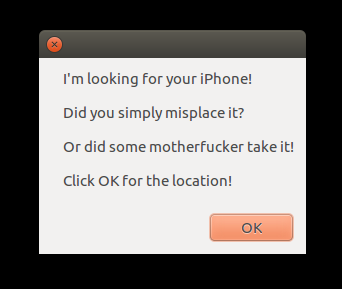
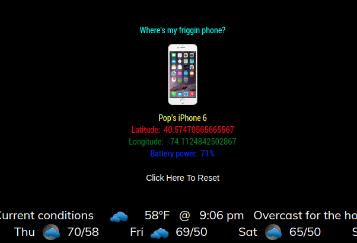

# MMM-FMI 

A MagicMirror module that beeps your iPhone and tells you its location.

## Has this ever happened to you?

How many times have you misplaced your iPhone? You know it's around there somewhere!
Do you ask someone to call your phone? What if no one is there to help you? And what if
your iPhone is on mute. That doesn't make finding it any easier. And what if you really lost your iPhone, or even worse, someone stole it?

This module will beep your iPhone even if it is on mute and will tell you it's location.

## Examples

You are presented with an iPhone image.

When clicked, it gives you an alert window. Read the alert and click OK.

Then you are presented with the location of your iPhone while beeping the iPhone itself.

Click "Reset this module" and only the iPhone icon remains, ready for the next time you need to find your iPhone.

* Uses very little of your precious mirror real estate. Fits anywhere!

## Installation

* `git clone https://github.com/mykle1/MMM-FMI.git` into the `~/MagicMirror/modules` directory.

* `cd MMM-FMI`

* `npm install`

## Add to Config.js

    {
            disabled: false,
            module: 'MMM-FMI',
            header: "",                                // standard header, underlined
            position: 'bottom_center',
        config: {
                email: "Your iCloud email address",
                pass: "Your iCloud password",
                lat: "40.111111",                     // your latitude
                lon: "-74.111111",                    // your longitude
                title: "",                            // Use instead of header. Not underlined!
                maxWidth: "400px",
			}
        },

## Mad props!

This was originally cowboysdude's module/idea. For whatever reason, he lost interest in developing it.
With his permission and generosity, I completed the module and am passing it off as my own. :-)
